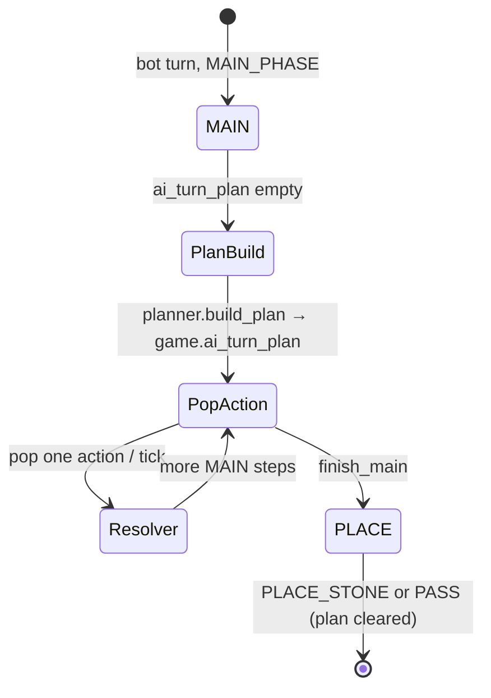

# AI package

**AI implementation is complete** for the planned bot feature set (MAIN cards/targets/stone + PLACE). Placement and card **strength tuning are deferred**—the bot may play weakly on the board or miss synergies until weights are tuned.

See [../docs/ai.md](../docs/ai.md) for architecture, MCTS flow, and placement scoring.

## Phase 3 — full turn pipeline



| Resolver action | When |
|-----------------|------|
| `PLAY_CARD` | Planner chose a card script |
| `SELECT_BOARD_TARGET` | Targeted card (before `PLAY_CARD`) |
| `SELECT_STONE` | Plan step or stone-only MAIN |
| `PLACE_STONE` | PLACE phase |
| `PASS_TURN` | No legal placement |

Plan queue: `game.ai_turn_plan`, built once at MAIN start when empty, one action per `tick_ai`. Cleared after successful `PLACE_STONE` or `PASS_TURN`.

## Tunables

| Field | Effect |
|-------|--------|
| `game.ai_planner_enabled` | `true` (PVC default): MAIN uses `ai/turn/planner.lua`. `false`: stone-only MAIN (Phase 1). |
| `game.ai_planner_max_scripts` | Cap scripts enumerated per plan (default `12`). |
| `game.ai_strategy` | `"heuristic"` (default) or `"random"`. `"mcts"` aliases heuristic; gates placement MCTS only. |
| `game.ai_difficulty` | `"easy"` / `"normal"` / `"hard"` → `mcts_config.DIFFICULTY`. |
| `game.ai_mcts` | Overrides preset. **Normal PVC: MCTS off**; placement = cheap prescore + ≤8 full `evaluate_move`. |
| `game.ai_mcts.enabled` | `false` → no placement MCTS. |
| `game.ai_mcts.iterations` | Playout budget when MCTS enabled (`hard` ~20, `max_decision_ms` cap). |

PVC defaults (`game.new`): `ai_planner_enabled = true`, `ai_planner_max_scripts = 12`, `ai_difficulty = "normal"`, MCTS off.

## Disable features

```lua
-- No cards in MAIN (stone only)
g.ai_planner_enabled = false

-- No placement MCTS
g.ai_mcts = { enabled = false, iterations = 0 }
g.ai_difficulty = "easy"
```

## Latency

- Planner: no `compute_from_board`, no MCTS, no `resolve_round`.
- PLACE: at most **8** full evals after cheap prescore (`placement.FULL_EVAL_TOP_N`).
- MCTS rollouts (hard only): fast eval, time-budgeted.

## Territory debug

`config.TERRITORY_DEBUG = true` re-enables `[Territory]` prints. Default `false`.
