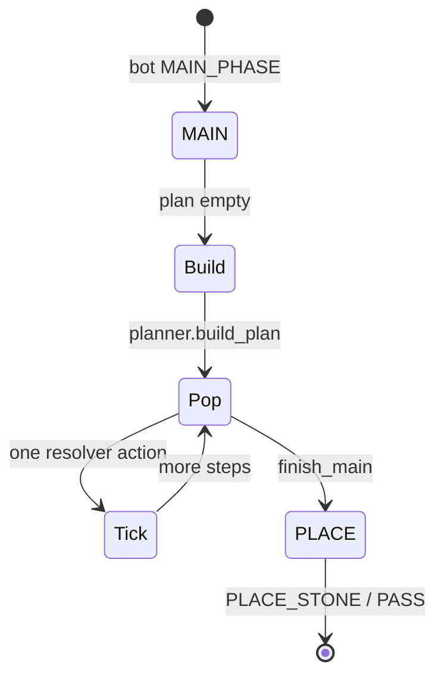

# AI package

**AI implementation is complete** for the planned bot feature set (MAIN cards/targets/stone + PLACE). Placement and card **strength tuning are deferred**—edit weights in `ai/config.lua`, not scattered module constants.

See [../docs/ai.md](../docs/ai.md) for architecture and MCTS flow.

## Tuning the bot

**Single file:** [`ai/config.lua`](config.lua) — profiles, defaults, and field docs in the module header.

Precedence: `game.ai_placement` / `game.ai_mcts` / `game.ai_planner_*` overrides → `game.ai_difficulty` profile → `M.*` defaults.

```lua
local ai_config = require("ai.config")
ai_config.apply_profile(g, "hard")
-- or per-match overrides after game.new:
g.ai_placement = { prescore_enabled = false, full_eval_top_n = 12 }
g.ai_mcts = { enabled = false }
g.ai_scoring = { decision_mode = "margin" }
```

### Keys (`ai.config`)

| Section | Field | Default (normal) | Effect |
|---------|-------|------------------|--------|
| `placement` | `candidate_k` | 30 | Max filtered candidates from movegen |
| `placement` | `full_eval_top_n` | 8 | Max `evaluate_move` calls when list is larger |
| `placement` | `prescore_enabled` | true | Cheap prescore sort for movegen + placement pool |
| `placement.suggestion` | `enabled` | false | Dual ranker PLACE path (`dual_suggest`); PVC normal leaves off |
| `placement.suggestion` | `stone_only_main` | true | When suggestion on, MAIN is stone select only (no card planner) |
| `placement.suggestion` | `n_heuristic` / `n_score` | 8 / 8 | Top-K per ranker before merge; 0 = unlimited |
| `placement.suggestion` | `max_stones` / `max_legal_per_stone` | 0 / 0 | Caps on stones and legal moves per stone; 0 = unlimited |
| `placement` | `weights` | see config | Per-term multipliers for full eval |
| `placement` | `heuristics` | all enabled | `{ id, enabled }` list for full-tier terms (see `ai/heuristics/placement_terms.lua`) |
| `mcts` | `enabled` | false (normal) | Placement MCTS on/off |
| `mcts` | `iterations` | 0 (normal) | Root playouts per placement |
| `mcts` | `max_rollout_depth` | 3 | Rollout plies |
| `mcts` | `exploration_c` | 1.4 | UCT constant |
| `mcts` | `fast_rollout` | true | Fast eval in rollouts (no territory assignment) |
| `mcts` | `max_decision_ms` | 0 (normal) | Time cap; hard uses 100 |
| `planner` | `enabled` | true | MAIN script planner |
| `planner` | `max_scripts` | 12 | Cap MAIN scripts per plan |
| `scoring` | `decision_mode` | `"absolute"` | `"absolute"` = max own heuristic; `"margin"` = my − opp (normal profile uses `"margin"`) |

### Profiles

| Profile | Placement | MCTS |
|---------|-----------|------|
| `easy` | k=24, top 6 evals, prescore on | off |
| `normal` | k=30, top 8 evals, prescore on | off |
| `hard` | k=30, top 8 evals, prescore on | on, 20 iters, 100ms cap |

PVC `game.new` calls `ai_config.apply_profile(g, "normal")`.

### `prescore_enabled = false`

- **Movegen:** filtered moves in stable legal order, first `candidate_k` (no prescore sort).
- **Placement:** `evaluate_move` on each candidate up to `full_eval_top_n` (safety cap); no `placement_cheap.top_by_cheap_score`.
- To full-eval all filtered moves: set `prescore_enabled = false` and `full_eval_top_n >= candidate_k`.

`ai/mcts_config.lua` remains a thin wrapper over `ai.config` for older `require` paths.

## Phase 3 — full turn pipeline



## Disable features

```lua
g.ai_planner_enabled = false
g.ai_mcts = { enabled = false, iterations = 0 }
```

## Latency

- Planner: no `compute_from_board`, no `resolve_round`.
- PLACE (normal): prescore → ≤ `full_eval_top_n` full evals.
- MCTS (hard): fast eval, `max_decision_ms` budget.

## Territory debug

`config.TERRITORY_DEBUG = true` re-enables `[Territory]` prints.
