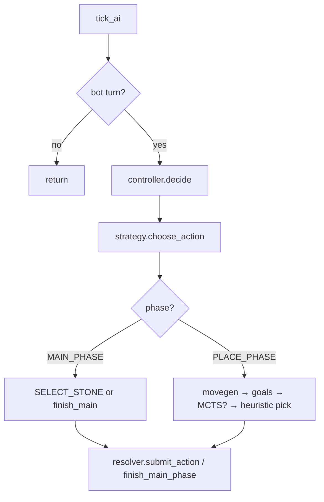
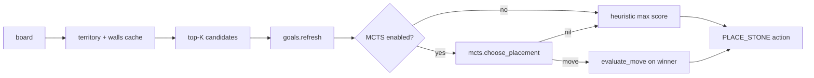
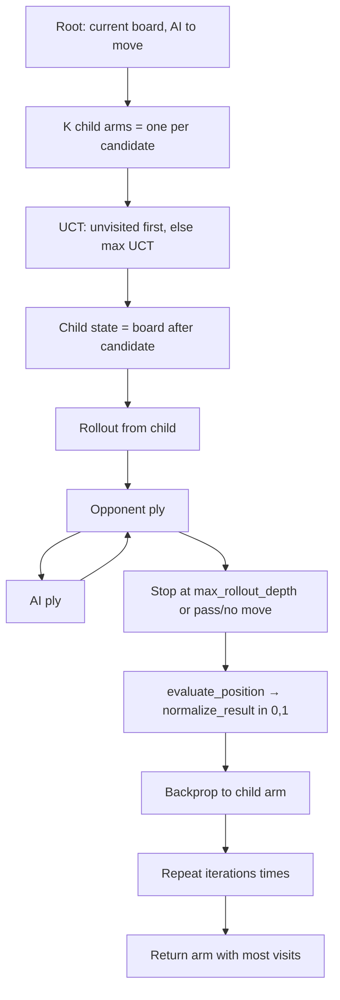

# Bot AI

The bot drives **Player vs Computer (PVC)** matches. **Phase 3** adds a full MAIN pipeline (optional card + board target + stone) via a per-turn action plan; PLACE is unchanged. Search never calls `resolve_round`. Card/stance **strength tuning is deferred**—see [../ai/README.md](../ai/README.md).

## Entry points

| Layer | Module | Role |
|-------|--------|------|
| Game loop | `game.tick_ai` | Waits for `ai_delay`, then calls the controller once per tick |
| Controller | `ai.controller` | Picks strategy, builds a `MatchView` for the bot actor, returns one resolver action (or `finish_main`) |
| Strategy | `ai.strategies.heuristic` | MAIN: planner queue or stone-only; PLACE: top-K + scoring (+ optional MCTS) |
| Fallback | `ai.strategies.random` | Random legal placement (tests / debug) |

Bot side is defined by `config.AI_COLOR` (PVC: white). `ai.controller.is_bot_turn(game)` is true when `game.versus_bot` and `game.to_play` matches that actor.

## Package layout

```
ai/
  controller.lua              # strategy dispatch
  mcts_config.lua               # defaults, difficulty presets, should_run
  adapters/match_view.lua       # read-only game facade (+ sim board for rollouts)
  turn/
    plan.lua                    # ai_turn_plan queue
    scripts.lua                 # legal MAIN scripts
    planner.lua                 # pick best script (cheap scores)
  strategies/
    heuristic.lua               # MAIN + PLACE pipeline
    random.lua
  movegen/placement_candidates.lua
  heuristics/
    placement.lua               # per-move score + best_candidate (MCTS hook)
    goals.lua                   # strategic blackboard
    stone_select.lua
  board_analysis/
    features.lua                # static + delta features
    territory.lua               # wrapper over resolver territory
    evaluate.lua                # static eval for MCTS rollouts
    snapshot.lua                # board/ko clone helpers
  search/mcts.lua               # shallow placement MCTS
```

Legacy `ai.lua` re-exports the controller for older call sites.

## Turn flow



Each `decide` call returns **at most one** action. MAIN may take several ticks (stone select, then `finish_main` signal). PLACE returns `PLACE_STONE` or `PASS_TURN`.

## MAIN phase (heuristic)

1. If no playable stones → signal `finish_main`.
2. Otherwise `stone_select.choose_index` picks a stone; emit `SELECT_STONE`.
3. When the chosen stone is already selected → signal `finish_main`.

Cards are never played in Phase 1/2.

## PLACE phase (heuristic + optional MCTS)

Per placement decision the pipeline runs once:

1. **Cache** `territory_analysis.analyze(board)` and `enclosure.extract_walls(board)`.
2. **Candidates** — `movegen.top_candidates(view, stone_id, K=30, …)`:
   - Legal moves filtered to captures, frontier (wall-aware), or territory-changing plays.
   - Cheap prescore, then top-K with tie-shuffle via `match_state.rng_next_int`.
3. **Goals** — `goals.refresh(view, base_features, territory_before)` sets `game.ai_goals` (0–2 active goals).
4. **Pick** — `placement.best_candidate`:
   - If MCTS enabled → `mcts.choose_placement`; on success, re-score winner with `evaluate_move` for logging.
   - Else (or MCTS returns nil) → max heuristic score over candidates.



## Heuristic placement scoring

`placement.evaluate_move` applies `rules.try_play`, builds before/after features, and sums weighted deltas (`placement.WEIGHTS`):

| Feature | Weight | Meaning |
|---------|--------|---------|
| `delta_territory_me` | 4.0 | Empty cells gained for bot |
| `delta_captures` | 12.0 | Stones captured |
| `delta_enclosure_inside` | 2.5 | Growth inside largest enclosure |
| `closes_region` | 3.0 | Enclosure grew or contested shrank with territory gain |
| `frontier` | 2.0 | Move on placement frontier (wall-aware) |
| `contested_pressure` | 1.5 | Contested before, territory gain after |
| `weak_boundary_penalty` | −1.0 | Per new weak boundary cell |
| `self_fill_penalty` | −6.0 | Interior fill with no capture, frontier, or territory gain |

Plus `goals.candidate_bonus(view, candidate)` (see below).

## Strategic goals

Updated **once per placement decision** (not per MCTS node). Active goals are stored on `game.ai_goals` for replay/debug.

| Goal id | Activated when (`refresh`) | Candidate bonus |
|---------|---------------------------|-----------------|
| `expand_enclosure` | `largest_enclosure_inside_me > 0` | +4 if `delta_enclosure_inside > 0` |
| `claim_contested` | `territory_contested > 0` | +3 if `delta_territory_me > 0` |
| `cut_connectivity` | *(not activated in refresh)* | +6 if `delta_captures > 0` |

MCTS rollout leaves also apply `goals.position_bonus` (half weight) via `evaluate.evaluate_position`.

## Shallow MCTS

**Scope:** placement only, over the **existing top-K candidate list** — no expansion beyond those moves, no card simulation, no `resolve_round`.

Implementation: `ai/search/mcts.lua`.

### Algorithm



- **Selection:** UCT on root children; unvisited children are tried first.
- **Expansion:** Implicit — each root child is one candidate applied with `rules.try_play`. Candidates may include `stone_id` (dual-suggest pool); otherwise the bot’s selected stone or first playable stone is used (legacy path).
- **Simulation:** Alternate opponent and AI placement plies up to `max_rollout_depth` after the expanded node. AI rollout plies use the child arm’s `stone_id`.
- **Backprop:** Leaf value = normalized margin `evaluate.normalize_result(ai_eval, opp_eval)` in `[0, 1]`.
- **Final move:** Child with highest visit count (ties: first max in list order). Returns `{ row, col, stone_id? }`.

`placement_tree_depth` controls search expansion plies (default `1` = root arms only). `max_rollout_depth` is rollout length after each child. Values of `placement_tree_depth > 1` currently fall back to `1` (multi-ply expansion not implemented).

Dual PLACE (`placement.suggestion.enabled`) runs MCTS on the merged dual-suggest pool via `dual_suggest.choose_placement`; legacy PLACE keeps movegen + `placement.best_candidate` unchanged when suggestion is off.

All randomness uses `match_state.rng_next_int` (via `MatchView:rng_next_int`).

### Rollout policies

| Side | Policy |
|------|--------|
| **AI** | Sample uniformly among `movegen.top_candidates(..., K=5)` for the sim view |
| **Opponent** | `top_candidates(..., K=8)`; evaluate each with `evaluate_position`; sort; pick uniformly among top 3 |

Opponent stone kind comes from `match_view.for_actor(game, opponent).selected_stone`, or first playable stone if unset. Simulated boards use `match_view.with_board` so live game state is not mutated.

### Position evaluator (rollout leaf)

`ai/board_analysis/evaluate.lua` — static features, no per-move deltas:

| Feature | Weight |
|---------|--------|
| `territory_owned_me − territory_owned_opp` | 3.0 |
| `largest_enclosure_inside_me` | 1.5 |
| `wall_count_me` | 0.5 |
| `territory_contested` | −2.0 per cell |
| `weak_boundary_cells` | −0.3 per cell |
| Active goals (`position_bonus`) | half of goal weights |

Normalization: `0.5 + (ai_score − opp_score) / 40`, clamped to `[0, 1]`.

Root territory and walls can be passed in opts from `placement.best_candidate` to avoid recomputing at the root; rollouts re-analyze as the board changes.

### When MCTS runs

`mcts_config.should_run(game, strategy)`:

- **`heuristic` strategy:** MCTS runs only if `game.ai_mcts` exists, `enabled == true`, and `iterations > 0`. Omit `ai_mcts` on a match for pure heuristic behavior.
- **`mcts` strategy:** Same module as heuristic; MCTS follows `ai_mcts` / difficulty like above.
- Returns `nil` from `choose_placement` → heuristic fallback unchanged.

`ai_strategy = "mcts"` is an alias for the heuristic strategy module with MCTS config expected on the game.

## Configuration

All bot tunables live in **`ai/config.lua`** (profiles `easy` / `normal` / `hard`, placement prescore, MCTS, planner). See [../ai/README.md](../ai/README.md).

### PVC defaults (`game.new`)

```lua
g.ai_strategy = "heuristic"
ai_config.apply_profile(g, "normal")  -- planner on, MCTS off, candidate_k=30, full_eval_top_n=8
```

### `game.ai_mcts` fields

| Field | Default (normal) | Description |
|-------|------------------|-------------|
| `enabled` | `true` | Master switch for placement MCTS |
| `iterations` | `80` | Playouts per placement decision |
| `placement_tree_depth` | `1` | Tree expansion plies (1 = root arms only) |
| `max_rollout_depth` | `8` | Rollout plies after expanded node |
| `exploration_c` | `1.4` | UCT exploration constant |

Resolution order: `mcts_config.DEFAULT` → `ai_difficulty` preset → per-field overrides on `game.ai_mcts` → optional per-call `opts` in `choose_placement`.

### Difficulty presets (`ai/mcts_config.lua`)

| `ai_difficulty` | MCTS | `iterations` | `max_rollout_depth` | `exploration_c` |
|-----------------|------|--------------|---------------------|-----------------|
| `easy` | off | 0 | 4 | 1.4 |
| `normal` | on | 80 | 8 | 1.4 |
| `hard` | on | 200 | 12 | 1.6 |

### Tuning examples

```lua
-- Disable MCTS (fast / weak bot)
g.ai_mcts = { enabled = false }

-- Stronger search without changing strategy name
g.ai_difficulty = "hard"

-- Fine-grained override after game.new
g.ai_mcts.iterations = 120
g.ai_mcts.exploration_c = 1.2
```

## Strategies

| `game.ai_strategy` | Behavior |
|--------------------|----------|
| `heuristic` | Smart placement; MCTS if `game.ai_mcts` configured and enabled |
| `mcts` | Same code as `heuristic` |
| `random` | Random legal placement |

## What is not implemented

- Playing cards or spending energy in MAIN
- Stance swapping
- Full-turn search (MAIN + PLACE jointly)
- Board targets / card effects in search
- Neural networks or learning

## Tests

| Spec | Covers |
|------|--------|
| `spec/unit/ai_mcts_spec.lua` | Evaluator, MCTS determinism (fixed RNG seed), disabled → nil |
| `spec/unit/ai_goals_spec.lua` | `refresh`, `candidate_bonus` |
| `spec/unit/ai_placement_heuristic_spec.lua` | Capture vs fill scoring |
| `spec/integration/ai_bot_spec.lua` | End-to-end PVC bot turn with MCTS |

Integration tests lower `iterations` / `max_rollout_depth` for speed; production PVC uses normal presets from `game.new`.

## Related code (outside `ai/`)

- `config.AI_COLOR` — which side the bot plays
- `match_state.rng_next_int` — deterministic RNG for MCTS and candidate tie-breaks
- `single_game.resolver.territory` / `enclosure` — territory and walls used by analysis
- `rules.try_play` — legal move simulation (same as resolver stone placement rules)
